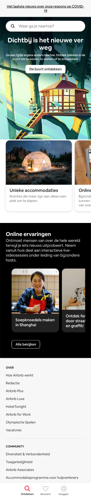
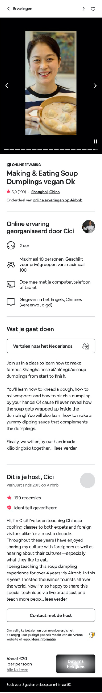

# Procesverslag
**Auteur:** Nine

Markdown cheat cheet: [Hulp bij het schrijven van Markdown](https://github.com/adam-p/markdown-here/wiki/Markdown-Cheatsheet). Nb. de standaardstructuur en de spartaanse opmaak zijn helemaal prima. Het gaat om de inhoud van je procesverslag. Besteedt de tijd voor pracht en praal aan je website.

## Bronnenlijst
1. -bron 1-
2. -bron 2-
3. -...-

## Eindgesprek (week 7/8)

-dit ging goed & dit was lastig-

**Screenshot(s):**

-screenshot(s) van je eindresultaat-

## Voortgang 3 (week 6)

-same as voortgang 1-

## Voortgang 2 (week 5)
In week 5 ben ik voornamelijk (en veel te lang) bezig geweest met de zoekbalk en de slider van de detailpagina. Bij de lukte niet om hem te centreren en voor de slider heb ik verschillende filmpjes moeten kijken.
Uiteindlijk heb ik de zoekbalk na aanleiding van een voorbeeld van Sanne hem aangepast. De slider is uiteindelijk gelukt.
Daarnaast ben ik ook lang bezig geweest om fontawesome iconen op de site te krijgen, dit is uiteindelijk ook gelukt.

## Voortgang 1 (week 3)
in week 3, na de voortang, heb ik niet zo veel gedaan aan de website omdat ik heel druk was met andere vakken. Wel heb ik stukjes in de code verandert. ik heb bijvoorbeeld de margin en padding van het hele bestand op 0 gezet, maar dit betekende dat ik alle andere paddings etc aan moest passen.

### Stand van zaken

-dit onderdeel was lastig. Het lukte me niet de figure samen met zijn afbeelding op een goed formaat te krijgen. uiteindelijk ben ik wel heel blij met het resultaat.-

### Agenda voor meeting

-samen met je groepje opstellen-

| Martijn        | Charlie            | Emma             | Jon              | Ik
| ---            | ---                | ---              | ---              | ---
| Classes?       | w3c validator      | Font             | header doet raar | ook  w3c validator
| Wel of niet?   |                    |                  |                  | img als achtergrond in header
|                |                    |                  |                  |

### Verslag van meeting

-na afloop snel uitkomsten vastleggen-

## Voortgang week 2
-in week 2 hebben we geoefend met flexbox

-de laatste opdracht was bij mij niet helemaal gelukt

## Breakdownschets (week 1)

## Intake (week 1)
-uitwerken voor de kick-off werkgroep - begin van de eerste week-

**Je startniveau:** Combinatie blauw en rood

**Je focus:** Surface plane

**Je opdracht:** https://www.airbnb.nl/

**Screenshot(s) van de eerste pagina (small screen):**

**Screenshot(s) van de tweede pagina (small screen):**

